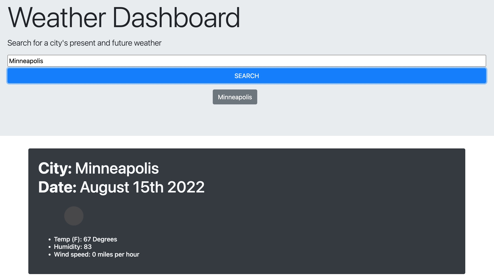

# Module-6-Challenge
Weather Dashboard

# Description

This repository contains HTML, CSS, and JAVASCRIPT files for a program that allows a user to search for a city and get current weather conditions for the searched city. When the user views the current weather conditions, the user is presented with the city name, date, an icon of the weather conditions, the temperature in fahrenheit, the humidity and the wind speed. 

# Screenshot

# Link to Application

[Jack Warrick's daily scheduler program](https://jackwarrick.github.io/Module-5-Challenge/)

